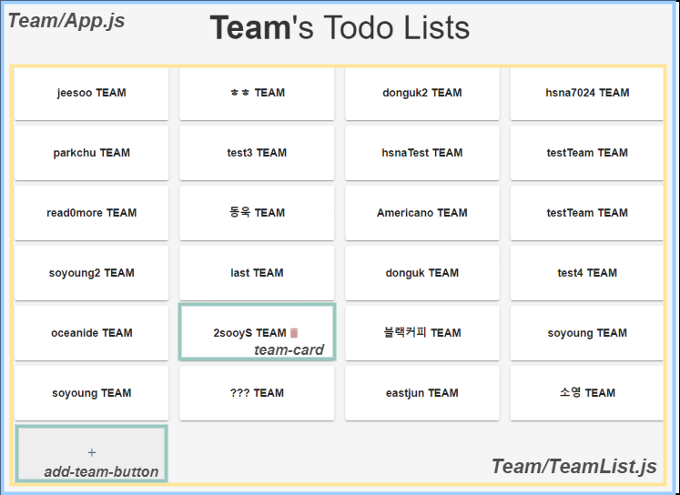
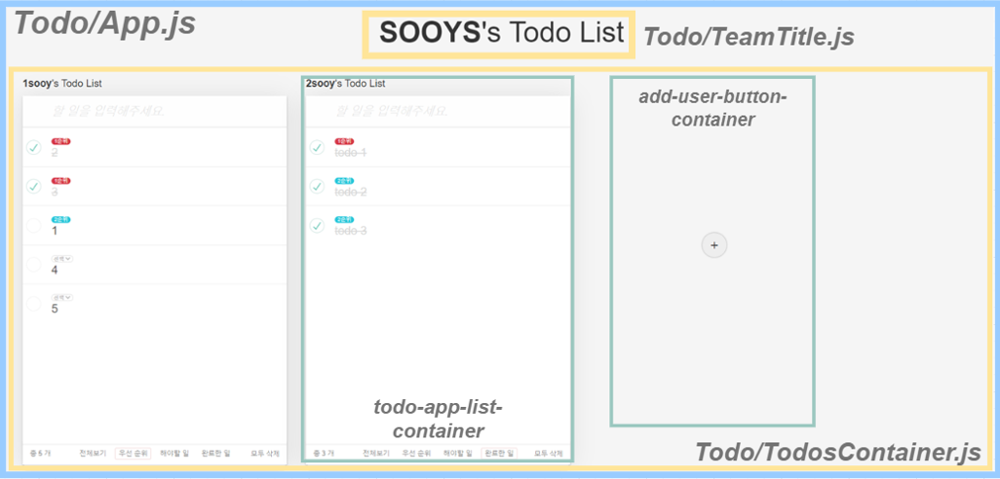

# ☕️ 코드리뷰 모임 - Black Coffee

<br>

> '훌륭한 의사소통은 블랙커피처럼 자극적이며, 후에 잠들기가 어렵다'. <br> A.M. 린드버그(미국의 작가, 수필가) -

<br>

블랙커피처럼 서로를 자극해주고, 동기부여 해주며, 그 성장과정으로 인해 의미있는 가치를 만들어내고자 하는  
**프론트엔드 코드리뷰 모임** ☕️ **Black Coffee**입니다.

## 🚀 세번째 미션 - Todo List for Team!

이번 미션은 팀을 위한 TodoList를 작성하는 미션입니다. 여러개의 컴포넌트의 상태값을 관리해야하는데요. TodoList가 1개 존재할 때보다 훨씬 더 고려할 것이 많습니다 😀

## 🎨 구조

```sh
.
├── public
│   ├── index.html   # 초기 팀리스트를 보여주는 페이지
│   └── kanban.html  # 팀 선택 후 팀원들의 todoList를 보여주는 페이지
└── src
    ├── css
    │   └── style.css
    └── js
        ├── index.js
        ├── Components
        │   ├── Team # 팀 리스트 페이지와 관련된 컴포넌트
        │   │   ├── App.js
        │   │   └── TeamList.js
        │   └── Todo # 팀원들의 TodoList와 관련된 컴포넌트
        │       ├── App.js
        │       ├── TeamTitle.js
        │       └── TodosContainer.js
        └── utils
            ├── api
            │   ├── index.js
            │   ├── team.js # 팀 추가 및 삭제와 관련된 API
            │   └── user.js # 팀원 추가, 팀원들의 TodoList 조작과 관련된 API
            ├── constants.js
            ├── templates
            │   ├── team.js # 팀리스트와 관련된 html markup을 모아놓은 파일
            │   └── user.js # 팀인원들의 TodoList html markup을 모아놓은 파일
            ├── util.js
            └── validation.js
```

### TeamList



### Team's TodoList



## 🎯 구현사항

- [x] 팀 추가하기
- [x] 팀 리스트 불러와서 화면에 보여주기
- [x] 팀에 멤버 추가하기
- [x] 팀원별 todoList 불러오기
- [x] 팀원별 todoItem 추가하기
- [x] 팀원별 todoItem 삭제하기
- [x] 팀원별 todoItem complete하기
- [x] 팀원별 todoItem contents 내용 수정하기
- [x] todoItem의 우선 순위 정하기 (defulat값:0, 1순위:1, 2순위: 2)
- [x] todoList의 우측 하단의 `전체 삭제`버튼을 누르면 해당 유저의 아이템을 전체 삭제하기
- [x] todoItem의 우선 순위에 따라 정렬하기

## 🍦 알게된 것

- [POSTMAN](https://www.postman.com/) 사용하기
- fetch API 사용시 option 객체에 대해 중복 최소화 하기(동적 프로퍼티)
- view port 초과 => `overflow-y : scroll`
- `이벤트 객체`에 대해 `tagName` or `className` 보다는 `classList` 적극 활용하기
- `URLSearchParams`를 이용한 URL 쿼리 스트링 가져오기
- `location.href`를 이용한 페이지 이동

## 🍞 고민한 것

- 주어진 html파일에서(index, kanban) 최상위 객체가 `id="app"`으로 동일한데, 이를 유지하면서 어떻게 어플리케이션을 설계할 수 있을까 ?
  - `location.href`를 활용하여 현재 페이지의 위치에 따라 `app`을 만들도록 설계
- 적절한 html 마크업 네이밍
- 각 App 컴포넌트의 state는 어떻게 설계해야 하는가 ?
  - App 컴포넌트는 API가 제공하는 state의 형태를 그대로 따름
  - 이외 별도로 필요한 state에 대해서는 필요한 컴포넌트에게 state 추가 (`selectedTab`)
- html 마크업에 대해 template을 어떤 식으로 분리해야할까 ?
  - 각각의 역할별로 template 분리 (TodoTitle / TodoInput / TodoItem / TodoCount / TodoTab )
- 효율적인 이벤트 처리 방법
  - 우선은 최상위 객체에 event를 등록하고 `e.target`에 따라 모든 기능을 넣었음
  - 따라서, 코드가 길어지는 단점이 있음 => 이후 분리 작업을 진행해야겠다는 생각

<br>

## 📝 License

This project is [MIT](https://github.com/next-step/js-todo-list-step3/blob/master/LICENSE) licensed.
