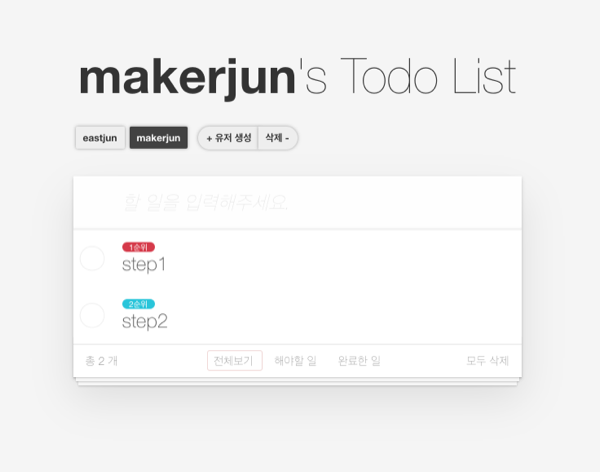

<p align="middle" >
  
</p>
<h2 align="middle">JS 투두리스트 스텝3</h2>
<p align="middle">팀을 위한 투두리스트</p>
<p align="middle">
  
  
  
  
  <a href="https://github.com/next-step/js-todo-list-step3/main/LICENSE" target="_blank">
    
  </a>
</p>

## 🔥 Projects!

<p align="middle">
  
</p>

<p align="middle">
  <a href="https://next-step.github.io/js-todo-list-step3/">🖥️ 데모 링크</a>
</p>

<br/>

## 🎯 index.html 팀 페이지 요구사항

- [ ] 1. 팀 추가하기
- [ ] 2. 팀 리스트 불러와서 화면에 보여주기

## 🎯 kanban.html 팀의 투두리스트 페이지 요구사항

- [ ] 1. 팀에 멤버 추가하기
- [ ] 2. 팀원별 todoList 불러오기
- [ ] 3. 팀원별 todoItem 추가하기
- [ ] 4. 팀원별 todoItem 삭제하기
- [ ] 5. 팀원별 todoItem complete하기
- [ ] 6. 팀원별 todoItem contents 내용 수정하기
- [ ] 7. todoItem의 우선 순위 정하기 (defulat값:0, 1순위:1, 2순위: 2)
- [ ] 8. todoList의 우측 하단의 `전체 삭제`버튼을 누르면 해당 유저의 아이템을 전체 삭제하기


## 🎯🎯 kanban.html 심화 요구사항
- [ ] 1. todoItem의 우선 순위에 따라 정렬하기


<br/>

## 📝 API
### 팀 추가

| method | uri |
|---|---|
|POST|/api/teams|

```javascript
{
 requestBody: {
   "name": "string"
 },
 response: {
   "_id": "string",
   "name": "string",
   "members": [...]
  }
}
```

### 팀 불러오기

| method | uri |
|---|---|
|GET|/api/teams/${teamId}|

```javascript
{
 response: {
   "_id": "string",
   "name": "string",
   "members": [...]
  }
}
```

### 팀 리스트 불러오기

| method | uri |
|---|---|
|GET|/api/teams|
```javascript
{
 response: [
  {
   "_id": "string",
   "name": "string",
   "members": [...]
  }
  ...
 ]
}
```

### 팀 삭제

| method | uri |
|---|---|
|DELETE|/api/teams/${teamId}|

```javascript
{
 response: {}
}
```

### 팀에 멤버 추가

| method | uri |
|---|---|
|POST|/api/teams/${teamId}/members|

```javascript
{
 requestBody: {
   "name": "string"
 },
 response: {
   "_id": "string",
   "name": "string",
   "members": [...]
  }
}
```

### 팀원별 TodoList 불러오기

| method | uri |
|---|---|
|GET|/api/teams/${teamId}/members/${memberId}|

```javascript
{
 response: [
  {
    "_id": "string",
   "name": "string",
   "todoList": []
  }
 ]
}
```

### 팀원의 TodoItem 추가하기

| method | uri |
|---|---|
|POST|/api/teams/${teamId}/members/${memberId}/items|

```javascript
{
 requestBody: {
   "contents": "string"
 },
 response: [
   {
   "_id": "string",
   "contents": "string",
   "priority": "string",
   "isCompleted": "boolean",
   }
   ...
 ]
}
```

### 팀원의 TodoItem 삭제하기

| method | uri |
|---|---|
|DELETE|/api/teams/${teamId}/members/${memberId}/items/${itemId}|

```javascript
{
 response: {}
}
```

### 팀원의 TodoItem toggle하기

| method | uri |
|---|---|
|PUT|/api/teams/${teamId}/members/${memberId}/items/${itemId}/toggle|


```javascript
{
 response: {
   "_id": "string",
   "contents": "string",
   "priority": "string",
   "isCompleted": "boolean",
   }
}
```

### 팀원의 TodoItem contents 수정하기

| method | uri |
|---|---|
|PUT|/api/teams/${teamId}/members/${memberId}/items/${itemId}|

```javascript
{
 requestBody: {
   "contents": "string"
 },
 response:    {
   "_id": "string",
   "contents": "string",
   "priority": "string",
   "isCompleted": "boolean",
   }
}
```

### 팀원의 TodoItem 우선순위 수정하기

| method | uri |
|---|---|
|PUT|/api/teams/${teamId}/members/${memberId}/items/${itemId}/priority|

```javascript
{
 requestBody: {
   "priority": "FIRST"
 },
 response: {
   "_id": "string",
   "contents": "string",
   "priority": "string",
   "isCompleted": "boolean",
 }
}
```

### 팀원의 TodoItem 전부 삭제

| method | uri |
|---|---|
|DELETE|/api/teams/${teamId}/members/${memberId}/items/|


```javascript
{
 response: {}
}
```

<br/>

# ☕️ 코드리뷰 모임 - Black Coffee
<br/>

> '훌륭한 의사소통은 블랙커피처럼 자극적이며, 후에 잠들기가 어렵다'. <br> A.M. 린드버그(미국의 작가, 수필가) -

<br/>

블랙커피처럼 서로를 자극해주고, 동기부여 해주며, 그 성장과정으로 인해 의미있는 가치를 만들어내고자 하는   
**프론트엔드 코드리뷰 모임** ☕️ **Black Coffee**입니다.

<br/>

## ⚙️ Before Started

####  로컬에서 서버 띄워서 손쉽게 static resources 변경 및 확인하는 방법

로컬에서 웹서버를 띄워 html, css, js 등을 실시간으로 손쉽게 테스트해 볼 수 있습니다. 이를 위해서는 우선 npm이 설치되어 있어야 합니다. 구글에 `npm install` 이란 키워드로 각자의 운영체제에 맞게끔 npm을 설치해주세요. 이후 아래의 명령어를 통해 실시간으로 웹페이지를 테스트해볼 수 있습니다.

```
npm install -g live-server
```

실행은 아래의 커맨드로 할 수 있습니다.

```
live-server 폴더명
```

<br/>


## 👏🏼 Contributing

만약 미션 수행 중에 개선사항이 보인다면, 언제든 자유롭게 PR을 보내주세요.

<br>

## 🐞 Bug Report

버그를 발견한다면, [Issues](https://github.com/next-step/js-todo-list-step3/issues)에 등록해주세요.

<br>

## 📝 License

This project is [MIT](https://github.com/next-step/js-todo-list-step3/blob/main/LICENSE) licensed.


